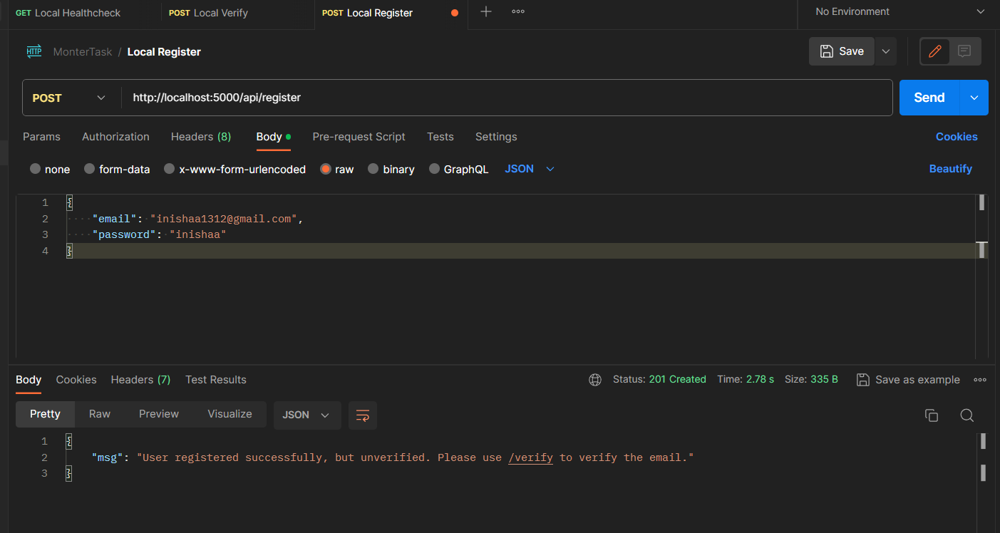
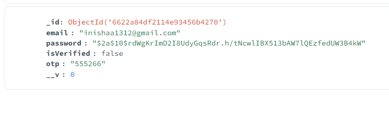
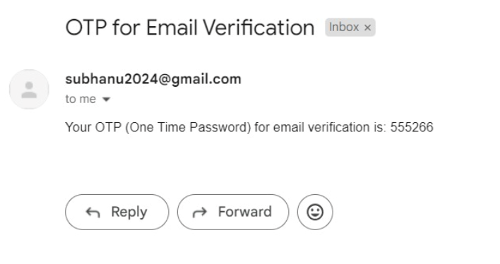
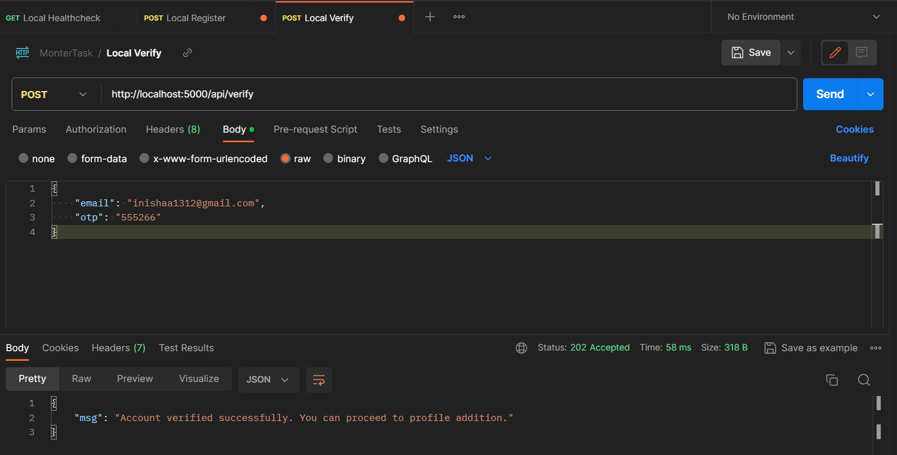
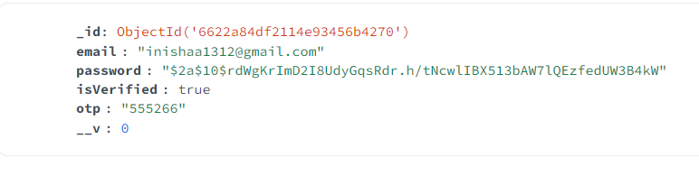
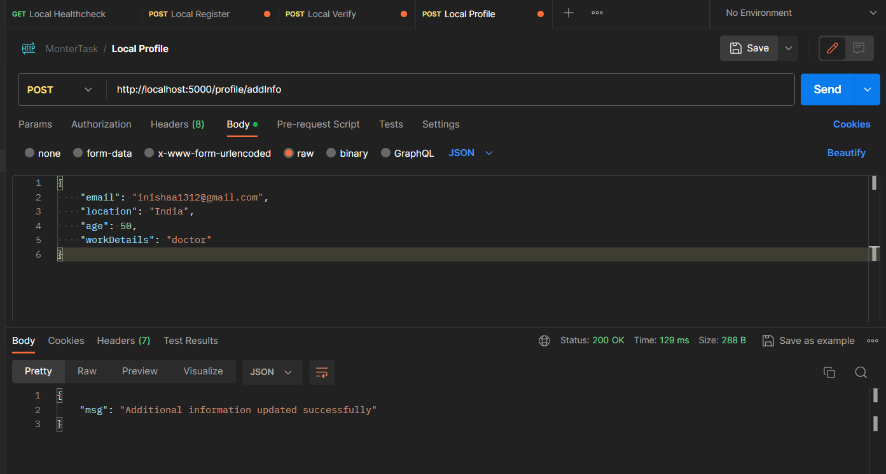
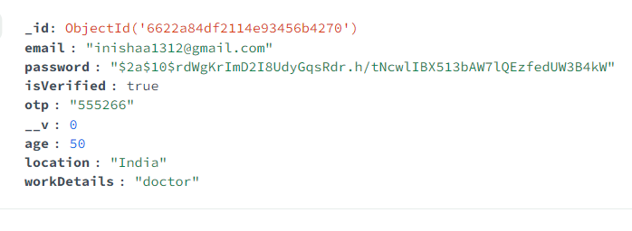
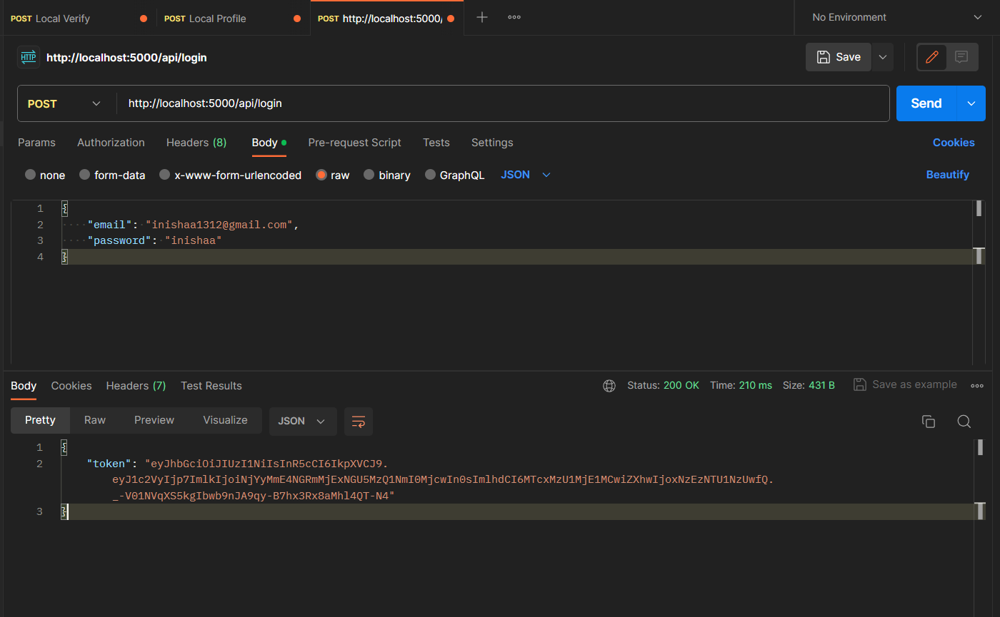
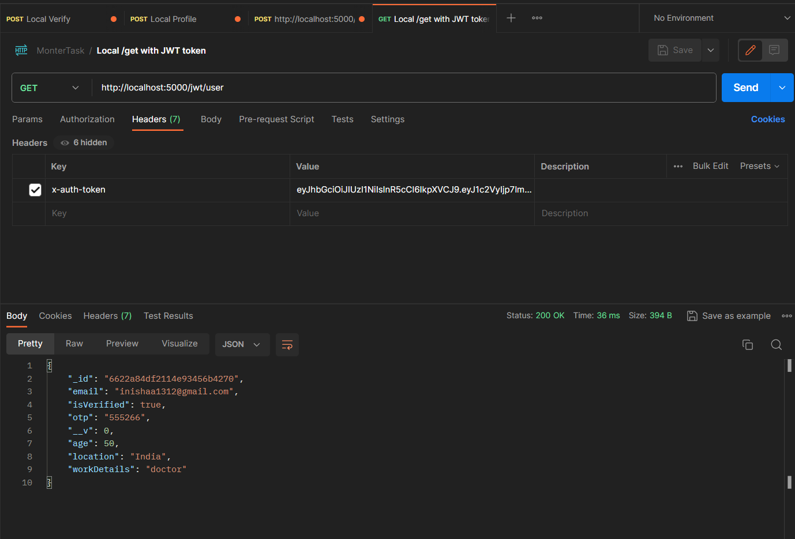

# monter-backend-task
 monter backend task done by Subhanu

# Tasks completed
- Created basic node and express application
- connected to mongodb locally
- made user schema
- made route to register with email and password
- made email sender service using nodemailer
- implement OTP generation to verify email
- implement addition of info after verification
- add JWT token for login
- get user details from token in header
- testing
- documentation

## api/register

## unverified user added to mongo, hashed password

## OTP sent to email

## api/verify

## User verified on mongo

## profile/addInfo

## details added to mongo

## jwt token generated on login

## /user details with jwt token in header
